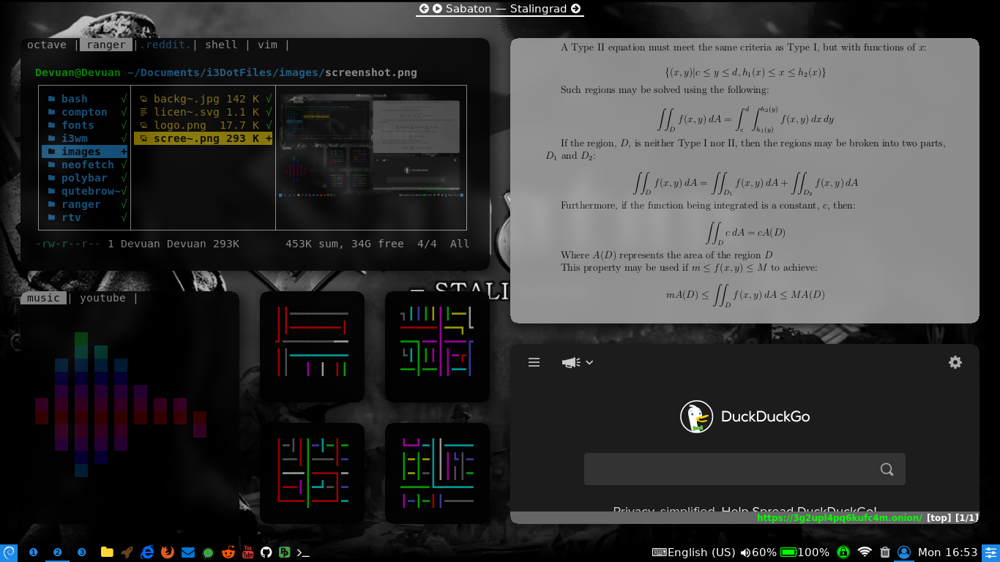

<!-- PROJECT LOGO -->
<br />
<p align="left">
  <a href="https://github.com/MDBrodskiy/i3DotFiles/tree/master/LICENSE">
    
</p>
<br/>
<br/>
<p align="center">
  <a href="https://github.com/MDBrodskiy/i3DotFiles">
    
  </a>

  <h3 align="center">i3 Window Manager DotFiles</h3>

  <p align="justify">
The <strong>i3wm</strong> dotfiles maintained in this repository also include customizable configurations for <strong>dunst</strong>, <strong> qutebrowser</strong>, <strong>polybar</strong>, <strong>neofetch</strong>, <strong>slim</strong>, <strong>mutt</strong>, <strong>rtv</strong>, <strong>compton</strong>, <strong>rofi</strong>, <strong>music visualizer</strong>, <strong>ranger</strong>, <strong>bash</strong>, and <strong>zsh</strong> as well as run command configurations for <strong>zathura</strong> and xdefaults definitions for <strong>XTerm</strong> and <strong>Rxvt-Unicode</strong> (<em>vim run commands have been omitted from this repo</em>).
<br />
</p>
<p align="center">
    <a href="https://github.com/MDBrodskiy/i3DotFiles"><strong>Explore the docs »</strong></a>
    <br />
    <br />
    <a href="https://github.com/MDBrodskiy/.vim">Redirection to <strong>vimrc</strong></a>
    ·
    <a href="https://en.wikipedia.org/wiki/I3wm">Wiki</a>
    ·
    <a href="https://i3wm.org/">HomePage</a>
  </p>
</p>





<!-- TABLE OF CONTENTS -->
## Table of Contents

* [**i3**](#i3)
  * [**i3-gaps**](#i3-gaps)
  * [**i3-radius**](#i3-radius)
* [**dunst**](#dunst)
* [**qutebrowser**](#qutebrowser)
* [**polybar**](#polybar)
* [**neofetch**](#neofetch)
* [**slim**](#slim)
* [**mutt**](#mutt)
* [**rtv**](#rtv)
* [**compton**](#comtpon)
* [**rofi**](#rofi)
* [**music visualizer**](#music-visualizer)
* [**ranger**](#ranger)
* [**bash**](#bash)
* [**zsh**](#zsh)
* [**zathurarc**](#zathurarc)
* [**xdefaults**](#xdefaults)
* [**texworks**](#texworks)
* [**fonts**](#fonts)
* [**usbmount**](#usbmount)


<!-- i3 -->
## i3 

The **i3** window manager is a Vi/Vim like keyboard driven tiling window manager; **i3** is an exemplary piece of minimalist, irreducibly complex software that runs efficiently and is accompanied with a very well written documentation.


A vanilla [**i3**](https://github.com/i3/i3) installation lacks peripheral features such as window container separation (*gaps*). As a result forked repos of i3, such as the following, exist to accommodate these feature requests:

`i3-gaps`, `i3-radius`, `i3-resolved`


* [**i3-gaps**](https://github.com/Airblader/i3)
* [**i3-gaps-deb**](https://github.com/maestrogerardo/i3-gaps-deb)
* [**i3-radius**](https://github.com/terroo/i3-radius)

**i3wm/** contains the **i3** [config](https://github.com/MDBrodskiy/i3DotFiles/tree/master/i3wm) file.

### i3-gaps

For **Debian** based systems use the following installer script:
**i3-gaps-deb** in **i3wm/**
```
git clone https://github.com/maestrogerardo/i3-gaps-deb
```

### i3-radius
 
```
git clone https://github.com/terroo/i3-radius
```
Before proceeding however, it is important to verify the path where **i3wm** is installed: `which i3`, as opposed to choosing the installation path, the above cloned installation script automatically renames **i3** `/usr/bin/i3`, to `/usr/bin/i3_original`. To achieve this same result manually: `sudo mv "$(which i3)" "$(which i3)_original"`.
```
cd i3-radius && sh build.sh
```


<!-- DUNST -->
## dunst

A customizable lightweight notification daemon. Clone, build, and install from:
```
git clone https://github.com/dunst-project/dunst
```

[<u>contains</u>](https://github.com/MDBrodskiy/i3DotFiles/tree/master/dunst): **dunstrc** and peripheral icons


<!-- QUTEBROWSER -->
## qutebrowser

A Vi/Vim like keyboard based configurable and lightweight web browser.

[<u>contains</u>](https://github.com/MDBrodskiy/i3DotFiles/tree/master/qutebrowser): **autoconfig.yml** file and script installing **dictioniares**


<!-- POLYBAR -->
## polybar 

A configurable text and Unicode based status bar. Clone, build, and install from:
```
git clone https://github.com/polybar/polybar
```

[<u>contains</u>](https://github.com/MDBrodskiy/i3DotFiles/tree/master/polybar): **polybar** themes and necessary peripherals


<!-- NEOFETCH -->
## neofetch 

A configurable system info script. Clone and install from:
```
git clone https://github.com/dylanaraps/neofetch
```

[<u>contains</u>](https://github.com/MDBrodskiy/i3DotFiles/tree/master/neofetch): **config.conf** 


<!-- SLiM -->
## SLiM

Simple login manager that is both lightweight and easily configurable.

[<u>contains</u>](https://github.com/MDBrodskiy/i3DotFiles/tree/master/slim): **slim.conf** & **themes** for slim


<!-- MUTT -->
## mutt

Simple text-based mail client.

[<u>contains</u>](https://github.com/MDBrodskiy/i3DotFiles/tree/master/mutt): **neomuttrc**, **vim-keybinds.rc** & **powerline** color and configuraions


<!-- RTV -->
## rtv

Reddit terminal viewer

[<u>contains</u>](https://github.com/MDBrodskiy/i3DotFiles/tree/master/rtv): **mailcap** & **config** file


<!-- COMPTON -->
## compton

A modifiable X11 compositor. In order to achieve the desired *kawase* blur method clone, build, and install from:
```
git clone https://github.com/tryone144/compton
```

[<u>contains</u>](https://github.com/MDBrodskiy/i3DotFiles/tree/master/compton): **compton.conf** 


<!-- ROFI -->
## rofi

For numerous rofi themes clone from:
```
git clone https://github.com/davatorium/rofi-themes
```


<!-- CLI MUSIC VISUALIZER -->
## music-visualizer

A terminal based music visualizer. Clone, build, and install from:

```
git clone https://github.com/dpayne/cli-visualizer
```


For a terminal based PulseAudio volume controller; clone, build, and install from:

```
git clone https://github.com/falconindy/ponymix
```

[<u>contains</u>](https://github.com/MDBrodskiy/i3DotFiles/tree/master/vis): **config** file and **color** schemes


<!-- RANGER -->
## ranger

A terminal based Vi/Vim like keyboard based file manager.

[<u>contains</u>](https://github.com/MDBrodskiy/i3DotFiles/tree/master/ranger): **rc.conf**, Archives **extract/compress** plugin, **DevIcons** plugin & necessary peripherals


<!-- BASH -->
## bash

[<u>contains</u>](https://github.com/MDBrodskiy/i3DotFiles/tree/master/bash): **bashrc** 


<!-- ZSH -->
## zsh

Peripheral plugins can be cloned from:
```
git clone https://github.com/ohmyzsh/ohmyzsh 
```

[<u>contains</u>](https://github.com/MDBrodskiy/i3DotFiles/tree/master/zsh): **zshrc** & **theme** definition file


<!-- ZATHURARC -->
## zathurarc

A Vi/Vim like keyboard driven PDF viewer.

[<u>contains</u>](https://github.com/MDBrodskiy/i3DotFiles/tree/master/zathura): **zathurarc**


<!-- XDEFAULTS -->
## xdefaults

[<u>contains</u>](https://github.com/MDBrodskiy/i3DotFiles/tree/master/xdefaults): **Xresources** & **URxvt** plugins


<!-- TEXWORKS -->
## TeXworks

[<u>contains</u>](https://github.com/MDBrodskiy/i3DotFiles/tree/master/TeXworks): TeXworks **CSS** "*stylesheets*"


<!-- FONTS -->
## fonts

An assortment of patched fonts.

[<u>contains</u>](https://github.com/MDBrodskiy/i3DotFiles/tree/master/fonts): ttf **fonts** 


<!-- USBMOUNT -->
## usbmount

Automates the process of mounting usb devices of various file systems, useful in tandem with applications like **ranger**.

[<u>contains</u>](https://github.com/MDBrodskiy/i3DotFiles/tree/master/usbmount): **usbmount.deb**


<!-- LICENSE -->
## License

Distributed under the MIT License. See [`LICENSE`](https://github.com/MDBrodskiy/i3DotFiles/tree/master/LICENSE) for more information.


<!-- CONTACT -->
## Contact

<a href="mailto:Michael@Brodskiy.com">Personal E-Mail</a> — [Personal Webpage](http://Michael.Brodskiy.com/)  

